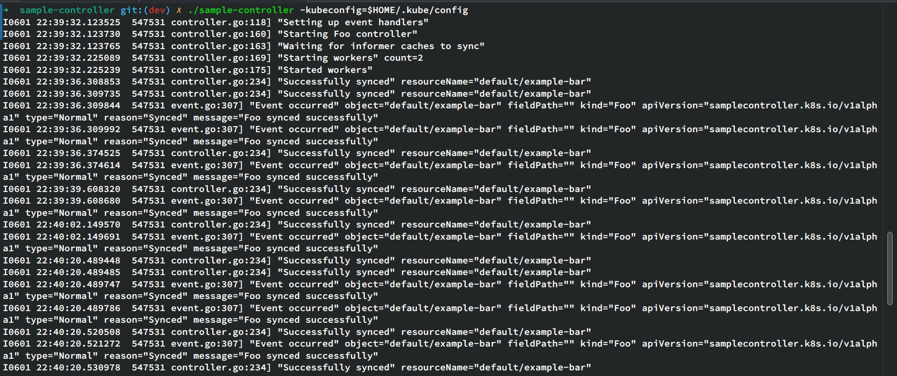
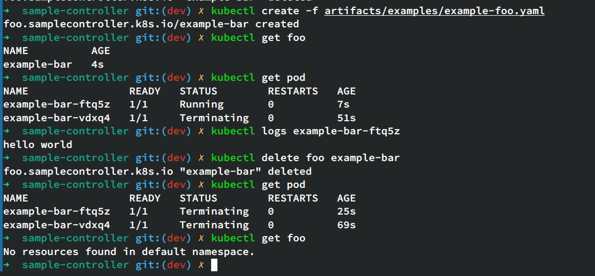

# sample-controller

实现了一个简易的CRD，利用Job自动执行用户指定命令。比如下面的Foo会输出hello world.

```yaml
apiVersion: samplecontroller.k8s.io/v1alpha1
kind: Foo
metadata:
  name: example-bar
spec:
  jobName: example-bar
  command:
    - /bin/sh
    - -c
    - "echo hello world; sleep 10000"
```

演示：

1. 编译、运行sample-controller：

   

2.  kubectl创建foo CRD，创建Foo资源example-bar，查看资源，查看Pod，查看Pod logs，输出hello world，删除Foo资源
    

   
